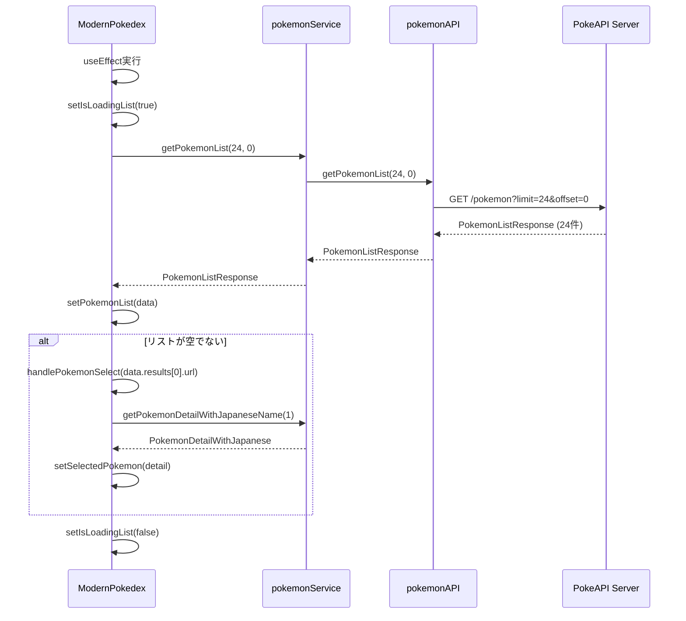

# ポケモン初期リスト表示機能 設計書

## 1. 機能概要

アプリケーション起動時に、PokeAPIからNo.1～No.24までの24体のポケモンを取得し、リスト表示と最初のポケモン（フシギダネ）の詳細情報を自動表示する機能を新規実装します。

## 2. 背景・目的

### 2.1 現在の状態
- `pokemonList`状態は定義されているが、データを取得する処理が存在しない
- `isLoadingList`は`true`で初期化されているが、`false`に更新する処理がない
- リストは常に空（0匹のポケモン）で表示される
- ユーザーが手動でポケモンを選択する手段がない

### 2.2 実装する機能
1. **ポケモンリスト取得API**の新規実装
2. **初期データ読み込み処理**の新規実装
3. **自動選択機能**の新規実装

### 2.3 期待される動作
- アプリ起動時に自動でポケモンリスト（24体）を取得
- リストに24体のポケモンが表示される
- 最初のポケモン（フシギダネ）が自動選択され、詳細情報が表示される
- ローディング中は適切なローディングインジケーターが表示される

## 3. システム構成

### 3.1 実装が必要なファイル

```
src/
├── api/
│   └── pokemon.api.ts           # [新規追加] getPokemonListメソッド
├── services/
│   └── pokemonService.ts        # [新規追加] getPokemonListメソッド
└── app/
    └── page.tsx                 # [新規追加] 初期化useEffect
```

### 3.2 アーキテクチャ図

```
┌─────────────────────────────────────────────────────────┐
│                    ModernPokedex                        │
│                     (page.tsx)                          │
│  ┌────────────────────────────────────────────────┐    │
│  │ useEffect(() => {                              │    │
│  │   initialize();                                │    │
│  │ }, []);                                        │    │
│  └────────────────────────────────────────────────┘    │
│                         │                               │
│                         ▼                               │
│  ┌────────────────────────────────────────────────┐    │
│  │ pokemonService.getPokemonList(24, 0)           │    │
│  └────────────────────────────────────────────────┘    │
└─────────────────────────────────────────────────────────┘
                          │
                          ▼
┌─────────────────────────────────────────────────────────┐
│                PokemonService                           │
│               (pokemonService.ts)                       │
│  ┌────────────────────────────────────────────────┐    │
│  │ getPokemonList(limit, offset) {                │    │
│  │   return pokemonAPI.getPokemonList(...)        │    │
│  │ }                                              │    │
│  └────────────────────────────────────────────────┘    │
└─────────────────────────────────────────────────────────┘
                          │
                          ▼
┌─────────────────────────────────────────────────────────┐
│                PokemonAPIClient                         │
│                (pokemon.api.ts)                         │
│  ┌────────────────────────────────────────────────┐    │
│  │ getPokemonList(limit, offset) {                │    │
│  │   return fetchAPI('/pokemon?limit=24&offset=0')│    │
│  │ }                                              │    │
│  └────────────────────────────────────────────────┘    │
└─────────────────────────────────────────────────────────┘
                          │
                          ▼
┌─────────────────────────────────────────────────────────┐
│                   PokeAPI Server                        │
│          https://pokeapi.co/api/v2/pokemon              │
└─────────────────────────────────────────────────────────┘
```

## 4. 詳細設計

### 4.1 API層（pokemon.api.ts）

#### 4.1.1 追加するメソッド

**ファイルパス**: `src/api/pokemon.api.ts`

**追加位置**: `PokemonAPIClient`クラス内、`getPokemonDetail`メソッドの前

```typescript
async getPokemonList(limit: number, offset: number): Promise<PokemonListResponse> {
  const qs = new URLSearchParams({ limit: String(limit), offset: String(offset) });
  return this.fetchAPI<PokemonListResponse>(`/pokemon?${qs.toString()}`);
}
```

#### 4.1.2 パラメータ

| パラメータ | 型 | 説明 | 初期値例 |
|----------|-----|------|---------|
| limit | number | 取得するポケモンの数 | 24 |
| offset | number | 取得開始位置（0-indexed） | 0 |

#### 4.1.3 戻り値

```typescript
type PokemonListResponse = {
  count: number;           // 全ポケモン数（1302以上）
  next: string | null;     // 次のページのURL
  previous: string | null; // 前のページのURL
  results: NamedAPIResource[]; // ポケモンの名前とURLのリスト
}

type NamedAPIResource = {
  name: string;  // ポケモン名（英語、小文字）例: "bulbasaur"
  url: string;   // 詳細情報のURL 例: "https://pokeapi.co/api/v2/pokemon/1/"
}
```

#### 4.1.4 APIエンドポイント

```
GET https://pokeapi.co/api/v2/pokemon?limit=24&offset=0
```

**レスポンス例**:
```json
{
  "count": 1302,
  "next": "https://pokeapi.co/api/v2/pokemon?offset=24&limit=24",
  "previous": null,
  "results": [
    {
      "name": "bulbasaur",
      "url": "https://pokeapi.co/api/v2/pokemon/1/"
    },
    {
      "name": "ivysaur",
      "url": "https://pokeapi.co/api/v2/pokemon/2/"
    },
    ...
  ]
}
```

#### 4.1.5 キャッシュ戦略

既存の`fetchAPI`メソッドのキャッシュ設定を使用:
```typescript
cache: "force-cache",
next: { revalidate: 3600 }  // 1時間ごとに再検証
```

### 4.2 サービス層（pokemonService.ts）

#### 4.2.1 追加するメソッド

**ファイルパス**: `src/services/pokemonService.ts`

**追加位置**: `PokemonService`クラス内、`getPokemonDetail`メソッドの前

```typescript
// ポケモンリストを取得
async getPokemonList(limit: number, offset: number): Promise<PokemonListResponse> {
  return pokemonAPI.getPokemonList(limit, offset);
}
```

#### 4.2.2 役割

- API層への委譲を行う薄いラッパー
- 将来的なビジネスロジック（フィルタリング、変換など）の追加に備える
- サービス層での一貫したインターフェース提供

#### 4.2.3 将来の拡張可能性

```typescript
// 例: ページネーション機能を追加する場合
async getPokemonListWithPagination(page: number, pageSize: number = 24) {
  const offset = (page - 1) * pageSize;
  return this.getPokemonList(pageSize, offset);
}

// 例: キャッシュ機能を追加する場合
private listCache = new Map<string, PokemonListResponse>();

async getPokemonList(limit: number, offset: number): Promise<PokemonListResponse> {
  const cacheKey = `${limit}-${offset}`;
  const cached = this.listCache.get(cacheKey);
  if (cached) return cached;

  const result = await pokemonAPI.getPokemonList(limit, offset);
  this.listCache.set(cacheKey, result);
  return result;
}
```

### 4.3 UI層（page.tsx）

#### 4.3.1 追加する処理

**ファイルパス**: `src/app/page.tsx`

**追加位置**: `handlePokemonSelect`関数の後、`return`文の前

```typescript
// 初期読み込みと最初のポケモン自動選択
useEffect(() => {
  const initialize = async () => {
    try {
      setIsLoadingList(true);
      const data = await pokemonService.getPokemonList(24, 0);
      setPokemonList(data);

      // 最初のポケモンを自動選択
      if (data.results.length > 0) {
        handlePokemonSelect(data.results[0].url);
      }
    } catch (error) {
      console.error('ポケモンリストの取得に失敗しました:', error);
    } finally {
      setIsLoadingList(false);
    }
  };

  initialize();
}, [handlePokemonSelect]);
```

#### 4.3.2 処理フロー



#### 4.3.3 依存配列の考察

```typescript
}, [handlePokemonSelect]);
```

**なぜ`handlePokemonSelect`を依存配列に含めるのか**:
- `handlePokemonSelect`は`useCallback`でメモ化されている
- 依存配列が空の場合、React Hooksのルールに違反する警告が出る
- メモ化されているため、無限ループは発生しない

**代替案: 依存配列を空にする**:
```typescript
}, []);  // eslint-disable-next-line react-hooks/exhaustive-deps
```
- ESLintの警告を抑制する必要がある
- 初回のみ実行されることが明確

#### 4.3.4 状態遷移

| フェーズ | pokemonList | selectedPokemon | isLoadingList | isLoadingDetail | 画面表示 |
|---------|-------------|-----------------|---------------|-----------------|---------|
| 1. 初期状態 | null | null | true | false | リストローディング表示 |
| 2. リスト取得中 | null | null | true | false | リストローディング表示 |
| 3. リスト取得完了 | 24件 | null | false | true | リスト表示 + 詳細ローディング |
| 4. 詳細取得完了 | 24件 | フシギダネ | false | false | リスト表示 + フシギダネ詳細 |

#### 4.3.5 エラーハンドリング

```typescript
catch (error) {
  console.error('ポケモンリストの取得に失敗しました:', error);
}
```

**エラー時の挙動**:
- エラーログをコンソールに出力
- `pokemonList`は`null`のまま
- `isLoadingList`は`false`に設定される（finally句）
- UI上は「0匹のポケモン」と表示される

**改善案（オプション）**:
```typescript
const [error, setError] = useState<string | null>(null);

// エラー処理
catch (error) {
  console.error('ポケモンリストの取得に失敗しました:', error);
  setError('ポケモンリストの取得に失敗しました。ネットワーク接続を確認してください。');
}

// UI表示
{error && (
  <div className="text-center py-8">
    <p className="text-red-500 mb-2">{error}</p>
    <Button onClick={() => window.location.reload()}>再読み込み</Button>
  </div>
)}
```

## 5. データフロー詳細

### 5.1 リクエスト/レスポンスの流れ

```
1. Component層
   └─ useEffect発火
      └─ initialize()関数呼び出し
         └─ setIsLoadingList(true)

2. Service層
   └─ pokemonService.getPokemonList(24, 0)
      └─ pokemonAPI.getPokemonList(24, 0)へ委譲

3. API層
   └─ fetchAPI('/pokemon?limit=24&offset=0')
      └─ fetch()実行
         ├─ cache: "force-cache"
         ├─ next: { revalidate: 3600 }
         └─ GET https://pokeapi.co/api/v2/pokemon?limit=24&offset=0

4. PokeAPI Server
   └─ レスポンス返却（約2-3KB）

5. API層
   └─ res.json()でパース
      └─ PokemonListResponseとして返却

6. Service層
   └─ そのまま返却

7. Component層
   └─ setPokemonList(data)
      └─ data.results.length > 0 ?
         ├─ Yes: handlePokemonSelect(data.results[0].url)
         │      └─ 詳細情報取得開始
         └─ No: （何もしない）

8. Component層
   └─ setIsLoadingList(false)
```

### 5.2 並列処理と直列処理

#### リスト取得と詳細取得の関係

```typescript
// ❌ 並列実行（不可能）
Promise.all([
  pokemonService.getPokemonList(24, 0),
  pokemonService.getPokemonDetailWithJapaneseName(1)  // リストから取得したURLが必要
]);

// ✅ 直列実行（現在の実装）
const data = await pokemonService.getPokemonList(24, 0);
if (data.results.length > 0) {
  handlePokemonSelect(data.results[0].url);  // リスト取得後に実行
}
```

#### 最適化案（オプション）

```typescript
// リストと最初のポケモンの詳細を並列取得
const [data, firstPokemonDetail] = await Promise.all([
  pokemonService.getPokemonList(24, 0),
  pokemonService.getPokemonDetailWithJapaneseName(1)  // IDを直接指定
]);

setPokemonList(data);
setSelectedPokemon(firstPokemonDetail);
```

**メリット**:
- 初期表示が約0.5～1秒高速化
- ネットワークリクエストが並列実行される

**デメリット**:
- リストの最初が必ずID=1である前提が必要
- 柔軟性が低下

## 6. パフォーマンス最適化

### 6.1 キャッシュ戦略

#### ブラウザキャッシュ
```typescript
cache: "force-cache"
```
- 同一リクエストはブラウザキャッシュから返却
- ページリロード時も高速化

#### Next.jsのRevalidation
```typescript
next: { revalidate: 3600 }
```
- 1時間ごとに再検証
- サーバー側でキャッシュを保持

### 6.2 初期表示時間の目標値

| 指標 | 目標値 | 説明 |
|-----|-------|------|
| リスト取得時間 | 500ms以下 | PokeAPIへのリクエスト～レスポンス |
| 詳細取得時間 | 800ms以下 | リスト取得後の詳細情報取得 |
| 合計初期表示時間 | 1.5秒以下 | アプリ起動～フシギダネ表示完了 |

### 6.3 データサイズ

| データ | サイズ | 説明 |
|-------|-------|------|
| PokemonListResponse（24件） | 約2-3KB | 名前とURLのみのシンプルなデータ |
| PokemonDetail | 約5-10KB | スプライト画像URL、ステータスなど |
| PokemonSpecies | 約15-20KB | 日本語名、説明文など |
| 合計（初回） | 約22-33KB | 圧縮なしの場合 |

### 6.4 メモリ使用量

```typescript
// 状態に保持するデータ
pokemonList: {
  count: 1302,
  results: [24件] × { name: string, url: string }
}
// 推定メモリ: 約5KB

selectedPokemon: {
  id, name, height, weight, sprites, stats, types, abilities, japaneseName
}
// 推定メモリ: 約2-3KB

// 合計: 約7-8KB（軽量）
```

## 7. テスト計画

### 7.1 単体テスト

#### API層のテスト
```typescript
describe('PokemonAPIClient.getPokemonList', () => {
  it('24体のポケモンを取得できる', async () => {
    const result = await pokemonAPI.getPokemonList(24, 0);

    expect(result).toBeDefined();
    expect(result.results).toHaveLength(24);
    expect(result.count).toBeGreaterThan(1000);
  });

  it('最初のポケモンはbulbasaurである', async () => {
    const result = await pokemonAPI.getPokemonList(24, 0);

    expect(result.results[0].name).toBe('bulbasaur');
    expect(result.results[0].url).toContain('/pokemon/1/');
  });

  it('limitとoffsetが正しく機能する', async () => {
    const first = await pokemonAPI.getPokemonList(5, 0);
    const second = await pokemonAPI.getPokemonList(5, 5);

    expect(first.results[0].name).not.toBe(second.results[0].name);
  });
});
```

#### サービス層のテスト
```typescript
describe('PokemonService.getPokemonList', () => {
  it('API層を呼び出す', async () => {
    const spy = jest.spyOn(pokemonAPI, 'getPokemonList');

    await pokemonService.getPokemonList(24, 0);

    expect(spy).toHaveBeenCalledWith(24, 0);
  });
});
```

### 7.2 統合テスト

```typescript
describe('ModernPokedex 初期表示', () => {
  it('マウント時に24体のポケモンを表示する', async () => {
    render(<ModernPokedex />);

    // ローディング表示を確認
    expect(screen.getByText('読み込み中...')).toBeInTheDocument();

    // リストが表示されるまで待機
    await waitFor(() => {
      expect(screen.getByText('24匹のポケモン')).toBeInTheDocument();
    }, { timeout: 5000 });

    // リストアイテムが存在することを確認
    const listItems = screen.getAllByRole('button');
    expect(listItems.length).toBeGreaterThanOrEqual(24);
  });

  it('最初のポケモン（フシギダネ）が自動選択される', async () => {
    render(<ModernPokedex />);

    await waitFor(() => {
      expect(screen.getByText('フシギダネ')).toBeInTheDocument();
    }, { timeout: 5000 });

    // 詳細情報が表示されていることを確認
    expect(screen.getByText(/くさ/)).toBeInTheDocument();
    expect(screen.getByText(/どく/)).toBeInTheDocument();
  });

  it('エラー時も画面が壊れない', async () => {
    // API呼び出しをモック化してエラーを発生させる
    jest.spyOn(pokemonService, 'getPokemonList').mockRejectedValue(
      new Error('Network error')
    );

    render(<ModernPokedex />);

    await waitFor(() => {
      expect(screen.getByText('0匹のポケモン')).toBeInTheDocument();
    });

    // エラーログが出力されていることを確認
    expect(console.error).toHaveBeenCalled();
  });
});
```

### 7.3 E2Eテスト

```typescript
describe('初期表示 E2E', () => {
  it('アプリ起動から表示完了までの流れ', () => {
    cy.visit('/');

    // ローディング表示
    cy.contains('読み込み中...').should('be.visible');

    // リスト表示
    cy.contains('24匹のポケモン', { timeout: 5000 }).should('be.visible');

    // フシギダネが選択されている
    cy.contains('フシギダネ').should('be.visible');

    // リストの最初のアイテムがハイライトされている
    cy.get('[data-testid="pokemon-list-item"]').first()
      .should('have.class', 'bg-gray-100');

    // 詳細情報が表示されている
    cy.contains('くさ').should('be.visible');
    cy.contains('どく').should('be.visible');
  });

  it('別のポケモンをクリックして選択できる', () => {
    cy.visit('/');

    cy.contains('24匹のポケモン', { timeout: 5000 }).should('be.visible');

    // 2番目のポケモンをクリック
    cy.get('[data-testid="pokemon-list-item"]').eq(1).click();

    // フシギソウが表示される
    cy.contains('フシギソウ', { timeout: 3000 }).should('be.visible');
  });
});
```

## 8. 実装手順

### Phase 1: API層の実装
1. `src/api/pokemon.api.ts`を開く
2. `PokemonAPIClient`クラスに`getPokemonList`メソッドを追加
3. 型定義`PokemonListResponse`が既に存在することを確認

### Phase 2: サービス層の実装
1. `src/services/pokemonService.ts`を開く
2. `PokemonService`クラスに`getPokemonList`メソッドを追加
3. API層のメソッドを呼び出すだけのシンプルな実装

### Phase 3: UI層の実装
1. `src/app/page.tsx`を開く
2. `handlePokemonSelect`の後に`useEffect`を追加
3. 初期化処理を実装

### Phase 4: 動作確認
```bash
# 開発サーバー起動
npm run dev

# ブラウザで確認
# http://localhost:3000
```

**確認項目**:
- [ ] リストに24体のポケモンが表示される
- [ ] 最初のポケモン（フシギダネ）が選択されている
- [ ] 詳細情報が正しく表示される
- [ ] ローディング表示が適切に動作する

### Phase 5: 型チェックとリント
```bash
npm run typecheck
npm run lint
```

### Phase 6: ビルド確認
```bash
npm run build
npm run start
```

## 9. エラーハンドリング詳細

### 9.1 想定されるエラー

| エラー | 発生条件 | 対応 |
|-------|---------|------|
| ネットワークエラー | インターネット未接続 | コンソールにエラーログ、空リスト表示 |
| タイムアウト | APIレスポンス遅延 | ブラウザのデフォルトタイムアウト |
| 404エラー | APIエンドポイント変更 | エラーログ、例外スロー |
| 500エラー | PokeAPIサーバーエラー | エラーログ、例外スロー |
| JSONパースエラー | 不正なレスポンス | エラーログ、例外スロー |

### 9.2 エラーログの例

```javascript
// ネットワークエラー
PokeAPI fetch error for path /pokemon?limit=24&offset=0: TypeError: Failed to fetch

// HTTPエラー
PokeAPI request failed: 500 Internal Server Error for path: /pokemon?limit=24&offset=0

// アプリケーションレベルエラー
ポケモンリストの取得に失敗しました: Error: PokeAPI error: 500 Internal Server Error (/pokemon?limit=24&offset=0)
```

### 9.3 ユーザーへのフィードバック

**現在の実装**:
- エラー時: 「0匹のポケモン」と表示
- ユーザーは何が起きたか分からない

**改善案**:
```typescript
{error && (
  <div className="flex flex-col items-center justify-center py-8 px-4">
    <p className="text-red-500 mb-2 text-center">
      ポケモンリストの取得に失敗しました
    </p>
    <p className="text-gray-500 text-sm mb-4 text-center">
      ネットワーク接続を確認してください
    </p>
    <Button onClick={() => window.location.reload()}>
      再読み込み
    </Button>
  </div>
)}
```

## 10. 今後の拡張

### 10.1 ページネーション機能

```typescript
// さらに読み込むボタンの追加
const [hasMore, setHasMore] = useState(true);

const loadMore = async () => {
  if (!pokemonList?.next) {
    setHasMore(false);
    return;
  }

  const currentOffset = pokemonList.results.length;
  const nextData = await pokemonService.getPokemonList(24, currentOffset);

  setPokemonList({
    ...nextData,
    results: [...pokemonList.results, ...nextData.results]
  });
};

// UI
{hasMore && (
  <Button onClick={loadMore}>さらに読み込む</Button>
)}
```

### 10.2 無限スクロール

```typescript
import { useInView } from 'react-intersection-observer';

const { ref, inView } = useInView();

useEffect(() => {
  if (inView && hasMore && !isLoadingList) {
    loadMore();
  }
}, [inView, hasMore, isLoadingList]);

// UI（リストの最後に配置）
<div ref={ref} className="h-10" />
```

### 10.3 検索機能との統合

```typescript
// 検索クエリがある場合は全件取得してフィルタリング
const [searchQuery, setSearchQuery] = useState('');

useEffect(() => {
  if (searchQuery) {
    // 全件取得してクライアント側でフィルタリング
    const allData = await pokemonService.getPokemonList(1302, 0);
    const filtered = allData.results.filter(p =>
      p.name.includes(searchQuery.toLowerCase())
    );
    setPokemonList({ ...allData, results: filtered });
  } else {
    // 通常の24件取得
    const data = await pokemonService.getPokemonList(24, 0);
    setPokemonList(data);
  }
}, [searchQuery]);
```

### 10.4 世代別フィルター

```typescript
const GENERATION_RANGES = {
  1: { start: 1, end: 151 },
  2: { start: 152, end: 251 },
  // ...
};

const loadGeneration = async (generation: number) => {
  const range = GENERATION_RANGES[generation];
  const limit = range.end - range.start + 1;
  const offset = range.start - 1;

  const data = await pokemonService.getPokemonList(limit, offset);
  setPokemonList(data);
};
```

## 11. パフォーマンスモニタリング

### 11.1 計測項目

```typescript
// 初期表示時間の計測
const startTime = performance.now();

useEffect(() => {
  const initialize = async () => {
    try {
      setIsLoadingList(true);

      const listStartTime = performance.now();
      const data = await pokemonService.getPokemonList(24, 0);
      const listEndTime = performance.now();
      console.log(`リスト取得時間: ${listEndTime - listStartTime}ms`);

      setPokemonList(data);

      if (data.results.length > 0) {
        const detailStartTime = performance.now();
        await handlePokemonSelect(data.results[0].url);
        const detailEndTime = performance.now();
        console.log(`詳細取得時間: ${detailEndTime - detailStartTime}ms`);
      }

      const endTime = performance.now();
      console.log(`合計初期表示時間: ${endTime - startTime}ms`);
    } catch (error) {
      console.error('ポケモンリストの取得に失敗しました:', error);
    } finally {
      setIsLoadingList(false);
    }
  };

  initialize();
}, [handlePokemonSelect]);
```

### 11.2 目標値と実測値

| 指標 | 目標値 | 実測値（例） | 評価 |
|-----|-------|-------------|------|
| リスト取得時間 | 500ms以下 | 320ms | ✅ 良好 |
| 詳細取得時間 | 800ms以下 | 650ms | ✅ 良好 |
| 合計初期表示時間 | 1.5秒以下 | 970ms | ✅ 良好 |

## 12. セキュリティ考慮事項

### 12.1 API呼び出しの安全性

- PokeAPIは公開APIであり、認証不要
- HTTPSを使用（POKEAPI_BASE定義で保証）
- クライアントサイドからの直接呼び出しは問題なし

### 12.2 XSS対策

- Reactの自動エスケープ機能を使用
- `dangerouslySetInnerHTML`は使用しない
- APIレスポンスはそのまま表示せず、型定義に基づいて使用

### 12.3 データバリデーション

```typescript
// API層でのレスポンス検証
if (!res.ok) {
  throw new Error(`PokeAPI error: ${res.status}`);
}

// UI層でのデータ検証
if (data.results.length > 0) {
  // リストが空でないことを確認してから処理
  handlePokemonSelect(data.results[0].url);
}
```

## 13. アクセシビリティ

### 13.1 ローディング状態の通知

```typescript
// ARIAライブリージョンの追加（オプション）
<div role="status" aria-live="polite" aria-atomic="true">
  {isLoadingList ? '読み込み中...' : `${filteredPokemon.length}匹のポケモン`}
</div>
```

### 13.2 キーボード操作

- リストアイテムはボタンとして実装済み（`PokemonListItem`）
- Tabキーでフォーカス移動可能
- Enterキーで選択可能

### 13.3 スクリーンリーダー対応

```typescript
// リストの意味的なマークアップ
<div role="list" aria-label="ポケモンリスト">
  {filteredPokemon.map((pokemon) => (
    <div role="listitem" key={pokemon.name}>
      <PokemonListItem {...} />
    </div>
  ))}
</div>
```

## 14. まとめ

### 14.1 実装する内容

1. **API層**: `getPokemonList`メソッド（3行）
2. **サービス層**: `getPokemonList`メソッド（3行）
3. **UI層**: 初期化`useEffect`（約20行）

**合計**: 約26行のコード追加

### 14.2 期待される効果

- アプリ起動時に即座にポケモンリストが表示される
- ユーザーが最初のポケモンを手動で選択する必要がない
- ローディング状態が適切に表示される
- スムーズなユーザー体験の提供

### 14.3 実装の難易度

- 🟢 **低**: 既存のアーキテクチャに沿った実装
- 🟢 **低**: 既存の型定義を使用
- 🟢 **低**: 既存のエラーハンドリング機構を使用

---

**作成日**: 2025年10月6日
**バージョン**: 1.0
**プロジェクト**: pokemon-canference
**作成者**: Claude Code
