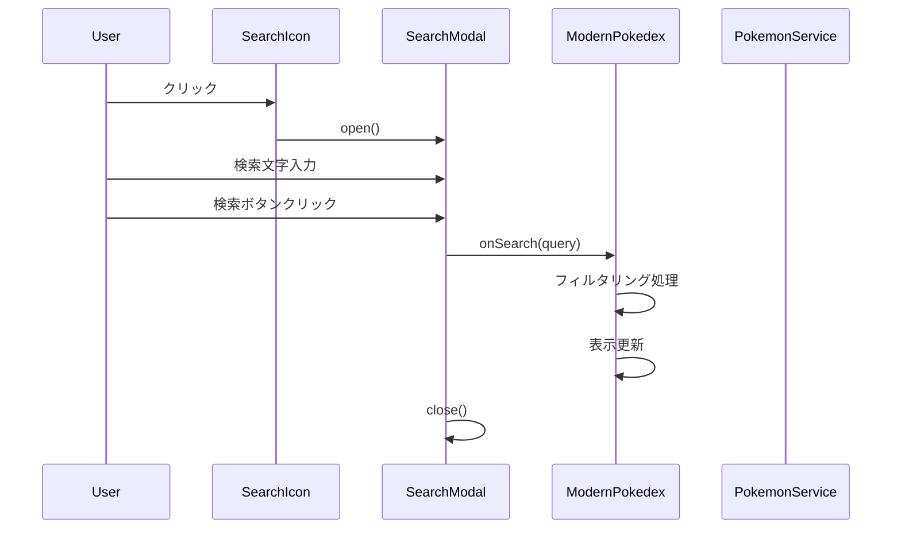

# ポケモン検索機能 詳細設計書

## 1. 機能概要

ポケモン図鑑にテキスト検索機能を追加し、ユーザーが入力した文字列でポケモン名を部分一致検索できるようにします。

## 2. システム構成

### 2.1 コンポーネント構成図

```
src/
├── app/
│   ├── layout.tsx          # [修正] Searchアイコンにクリックイベント追加
│   └── page.tsx            # [修正] 検索状態管理とフィルタリング処理
├── components/
│   ├── SearchModal.tsx     # [新規] 検索モーダルコンポーネント
│   └── SearchButton.tsx    # [新規] 検索ボタンラッパーコンポーネント
└── contexts/
    └── SearchContext.tsx   # [新規] 検索状態のContext（オプション）
```

## 3. 詳細設計

### 3.1 SearchModalコンポーネント

**ファイルパス**: `src/components/SearchModal.tsx`

#### インターフェース定義

```typescript
interface SearchModalProps {
  isOpen: boolean;
  onClose: () => void;
  onSearch: (query: string) => void;
  onClearFilter: () => void;
  currentQuery: string;
  hasActiveFilter: boolean;
}
```

#### 状態管理

```typescript
// ローカル状態
const [searchInput, setSearchInput] = useState<string>("");
const [isInputFocused, setIsInputFocused] = useState<boolean>(false);
```

#### 主要機能

1. **モーダル表示制御**
   - `isOpen`プロパティによる表示/非表示
   - ESCキーでの閉じる機能
   - 背景クリックでの閉じる機能

2. **検索入力**
   - テキスト入力フィールド
   - リアルタイムバリデーション（空白のみの入力を防ぐ）
   - 日本語入力対応（IME考慮）

3. **検索実行**
   - 「検索」ボタンクリック
   - Enterキーでの検索実行
   - 検索後のモーダル自動クローズ

4. **フィルタクリア**
   - 「フィルタをクリア」ボタン表示（アクティブなフィルタがある場合のみ）
   - クリア実行後のモーダル自動クローズ

#### UIレイアウト

```
┌────────────────────────────────────┐
│  ポケモン検索              [×]      │
├────────────────────────────────────┤
│                                    │
│  検索キーワード:                    │
│  ┌────────────────────────────┐   │
│  │ 例: ピカチュウ, pikachu     │   │
│  └────────────────────────────┘   │
│                                    │
│  ※ポケモン名の一部でも検索できます   │
│                                    │
│  [検索] [フィルタをクリア]           │
│                                    │
└────────────────────────────────────┘
```

### 3.2 SearchButtonコンポーネント

**ファイルパス**: `src/components/SearchButton.tsx`

#### 実装詳細

```typescript
interface SearchButtonProps {
  onClick: () => void;
  className?: string;
}
```

#### 機能

- Searchアイコンのクリックイベント処理
- ホバー時のビジュアルフィードバック
- アクセシビリティ対応（aria-label）

### 3.3 ModernPokedexコンポーネントの修正

#### 追加する状態

```typescript
// 検索関連の状態
const [searchQuery, setSearchQuery] = useState<string>("");
const [isSearchModalOpen, setIsSearchModalOpen] = useState<boolean>(false);
const [pokemonNameCache, setPokemonNameCache] = useState<Map<string, string>>(new Map());
```

#### フィルタリング処理

```typescript
const filteredPokemon = useMemo(() => {
  if (!searchQuery.trim()) {
    return pokemonList?.results || [];
  }

  const normalizedQuery = searchQuery.toLowerCase().trim();

  return pokemonList?.results.filter(pokemon => {
    // 英語名での部分一致検索
    if (pokemon.name.toLowerCase().includes(normalizedQuery)) {
      return true;
    }

    // 日本語名での部分一致検索（キャッシュから）
    const japaneseName = pokemonNameCache.get(pokemon.name);
    if (japaneseName && japaneseName.includes(searchQuery)) {
      return true;
    }

    return false;
  }) || [];
}, [pokemonList, searchQuery, pokemonNameCache]);
```

#### 日本語名キャッシュ戦略

```typescript
// ポケモンリスト取得時に日本語名を事前取得
useEffect(() => {
  const fetchJapaneseNames = async () => {
    if (!pokemonList?.results) return;

    const namesToFetch = pokemonList.results
      .filter(p => !pokemonNameCache.has(p.name))
      .slice(0, 10); // バッチで10件ずつ取得

    for (const pokemon of namesToFetch) {
      try {
        const japaneseName = await pokemonService.getPokemonNameInJapanese(pokemon.name);
        setPokemonNameCache(prev => new Map(prev).set(pokemon.name, japaneseName));
      } catch (error) {
        console.error(`Failed to fetch Japanese name for ${pokemon.name}`);
      }
    }
  };

  fetchJapaneseNames();
}, [pokemonList]);
```

### 3.4 layout.tsxの修正

#### 変更内容

```typescript
// SearchButtonコンポーネントの使用
import { SearchButton } from "@/components/SearchButton";

// 既存のSearchアイコンを置き換え
<SearchButton onClick={() => {/* Context経由でモーダルを開く */}} />
```

## 4. データフロー



## 5. 状態管理パターン

### Option 1: Props Drilling（シンプル）

- layout.tsx → page.tsx → SearchModal へprops経由で状態を渡す
- 実装が簡単だが、階層が深くなると管理が複雑

### Option 2: Context API（推奨）

```typescript
// SearchContext.tsx
interface SearchContextType {
  searchQuery: string;
  setSearchQuery: (query: string) => void;
  isModalOpen: boolean;
  openModal: () => void;
  closeModal: () => void;
  clearSearch: () => void;
}
```

### Option 3: グローバルイベント

```typescript
// window オブジェクトに関数を追加
window.openSearchModal = () => setIsSearchModalOpen(true);
```

## 6. パフォーマンス最適化

### 1. メモ化

- `useMemo`でフィルタリング結果をメモ化
- `useCallback`でイベントハンドラーをメモ化

### 2. 遅延読み込み

- 日本語名は必要に応じて順次取得
- 仮想スクロールとの組み合わせ

### 3. デバウンス（オプション）

- リアルタイム検索の場合、入力のデバウンス処理

## 7. エラーハンドリング

### 1. 検索結果0件

```typescript
{filteredPokemon.length === 0 && searchQuery && (
  <div className="text-center py-8 text-gray-500">
    「{searchQuery}」に一致するポケモンが見つかりませんでした
  </div>
)}
```

### 2. API エラー

- 日本語名取得失敗時は英語名のみで検索継続
- エラーログを出力し、ユーザー体験を損なわない

## 8. アクセシビリティ

### 1. キーボード操作

- Tab キーでのフォーカス移動
- Enter キーでの検索実行
- ESC キーでのモーダルクローズ

### 2. ARIA属性

- `aria-label`で各要素の説明
- `role="dialog"`でモーダルを識別
- `aria-modal="true"`でモーダル状態を通知

## 9. テスト計画

### 1. 単体テスト

- SearchModalコンポーネントの表示/非表示
- フィルタリングロジックの正確性
- 日本語・英語の部分一致検索

### 2. 統合テスト

- 検索実行から結果表示までのフロー
- フィルタクリア機能
- エラーケースの処理

## 10. 実装優先度

### Phase 1（必須）

- SearchModalコンポーネント基本実装
- 英語名での検索機能
- フィルタクリア機能

### Phase 2（推奨）

- 日本語名検索対応
- キャッシュ機能
- キーボードショートカット

### Phase 3（オプション）

- リアルタイム検索
- 検索履歴機能
- 高度なフィルタ（タイプ、世代など）

## 11. 実装例

### SearchModalコンポーネントの基本実装

```typescript
"use client";

import { useState, useCallback } from "react";
import {
  Dialog,
  DialogContent,
  DialogHeader,
  DialogTitle,
} from "@/components/ui/dialog";
import { Button } from "@/components/ui/button";
import { Input } from "@/components/ui/input";
import { X } from "lucide-react";

interface SearchModalProps {
  isOpen: boolean;
  onClose: () => void;
  onSearch: (searchQuery: string) => void;
  onClearFilter: () => void;
  hasActiveFilter: boolean;
}

export function SearchModal({
  isOpen,
  onClose,
  onSearch,
  onClearFilter,
  hasActiveFilter,
}: SearchModalProps) {
  const [searchInput, setSearchInput] = useState("");

  const handleSearch = useCallback(() => {
    onSearch(searchInput.trim());
    onClose();
  }, [searchInput, onSearch, onClose]);

  const handleClearFilter = useCallback(() => {
    setSearchInput("");
    onClearFilter();
    onClose();
  }, [onClearFilter, onClose]);

  const handleKeyDown = useCallback(
    (e: React.KeyboardEvent) => {
      if (e.key === "Enter") {
        handleSearch();
      }
    },
    [handleSearch]
  );

  return (
    <Dialog open={isOpen} onOpenChange={onClose}>
      <DialogContent className="sm:max-w-[500px]">
        <DialogHeader>
          <DialogTitle className="flex items-center justify-between">
            ポケモン検索
            <button
              onClick={onClose}
              className="rounded-sm opacity-70 ring-offset-background transition-opacity hover:opacity-100"
            >
              <X className="h-4 w-4" />
              <span className="sr-only">閉じる</span>
            </button>
          </DialogTitle>
        </DialogHeader>
        <div className="grid gap-4 py-4">
          <div className="grid gap-2">
            <label htmlFor="search" className="text-sm font-medium">
              検索キーワード:
            </label>
            <Input
              id="search"
              placeholder="ポケモン名を入力（例: ピカチュウ、pikachu）"
              value={searchInput}
              onChange={(e) => setSearchInput(e.target.value)}
              onKeyDown={handleKeyDown}
              className="w-full"
              autoFocus
            />
          </div>
          <div className="flex gap-2 justify-end">
            <Button onClick={handleSearch} className="bg-[#E53935] hover:bg-[#D32F2F] text-white">
              検索
            </Button>
            {hasActiveFilter && (
              <Button
                onClick={handleClearFilter}
                variant="outline"
                className="border-gray-300"
              >
                フィルタをクリア
              </Button>
            )}
          </div>
        </div>
      </DialogContent>
    </Dialog>
  );
}
```

### Context API実装例

```typescript
// contexts/SearchContext.tsx
"use client";

import { createContext, useContext, useState, ReactNode } from "react";

interface SearchContextType {
  searchQuery: string;
  setSearchQuery: (query: string) => void;
  isModalOpen: boolean;
  openModal: () => void;
  closeModal: () => void;
  clearSearch: () => void;
}

const SearchContext = createContext<SearchContextType | undefined>(undefined);

export function SearchProvider({ children }: { children: ReactNode }) {
  const [searchQuery, setSearchQuery] = useState("");
  const [isModalOpen, setIsModalOpen] = useState(false);

  const openModal = () => setIsModalOpen(true);
  const closeModal = () => setIsModalOpen(false);
  const clearSearch = () => {
    setSearchQuery("");
  };

  return (
    <SearchContext.Provider
      value={{
        searchQuery,
        setSearchQuery,
        isModalOpen,
        openModal,
        closeModal,
        clearSearch,
      }}
    >
      {children}
    </SearchContext.Provider>
  );
}

export function useSearch() {
  const context = useContext(SearchContext);
  if (context === undefined) {
    throw new Error("useSearch must be used within a SearchProvider");
  }
  return context;
}
```

---

**作成日**: 2025年10月6日
**バージョン**: 1.0
**プロジェクト**: pokemon-canference